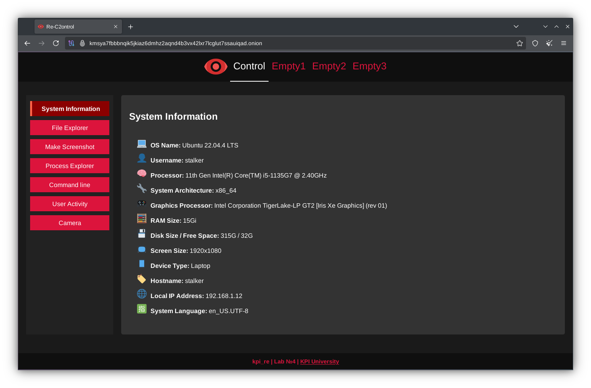
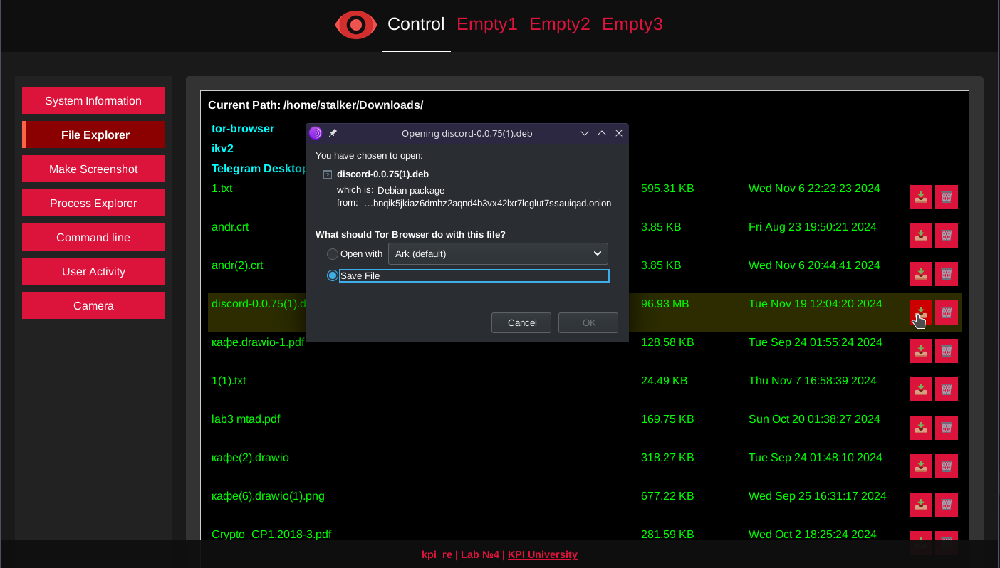
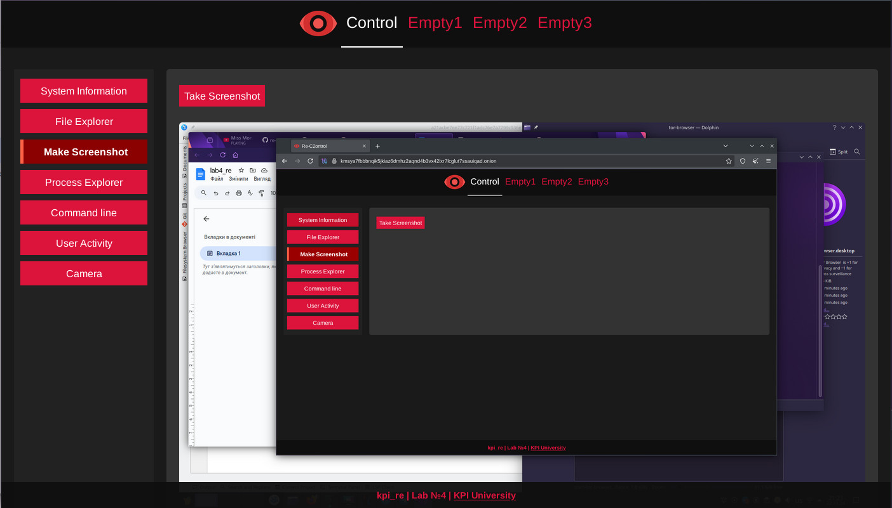
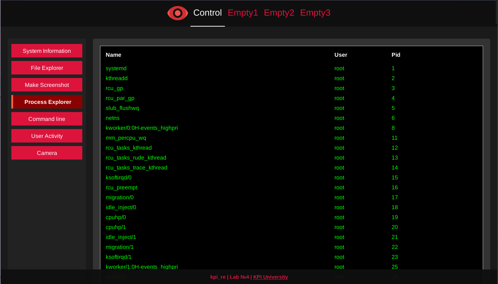
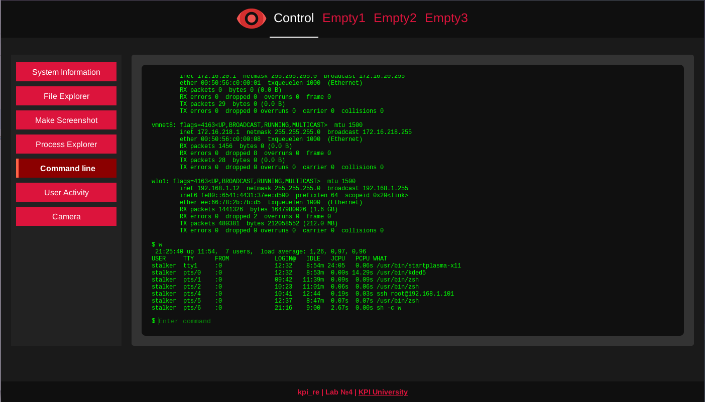
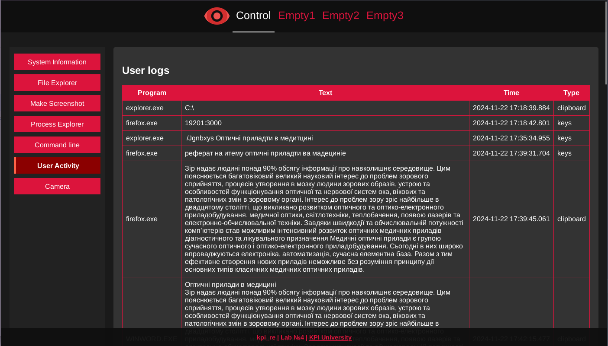

# Remote Control System Modeling

## Objective

Gain practical skills in the analysis and modeling of remote control systems .

## Task Description

Explore technologies used in malware and remote control system development through simulation and modeling.

This project focuses on simulating various techniques based on the [MITRE ATT&CK](https://attack.mitre.org/) framework:

## Implemented Techniques (MITRE ATT&CK)

- `T1082` – System Information Discovery  
- `T1059` – Command-Line Interface  
- `T1083` – File and Directory Discovery  
- `T1105` – Remote File Copy  
- `T1107` – File Deletion  
- `T1057` – Process Discovery  
- `T1056` – Input Capture  
- `T1115` – Clipboard Data  
- `T1113` – Screen Capture  
- `T1123` – Audio Capture  
- `T1125` – Video Capture   

## Features

- Supports **Windows** and **Linux** OS  
- Cross-platform control center **Web UI** 
- Follows [Vault7 Development Tradecraft DOs and DON'Ts](https://wikileaks.org/ciav7p1/cms/page_14587109.htmlhttps://wikileaks.org/ciav7p1/cms/page_14587109.html)  
- Includes anti-emulation and anti-virtualization techniques

## Screenshots

### System Information

### File Explorer

### Take Screenshot

### Process Explorer

### Command Line

### User Activity

### Camera & Microphone

## Disclaimer

> **This project is intended for educational and research purposes only.**  
> Misuse of this software may violate laws and regulations. The author is not responsible for any illegal or unethical usage.

---
